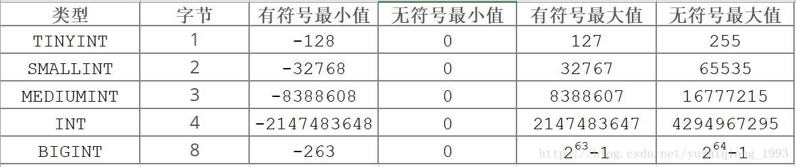
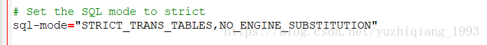
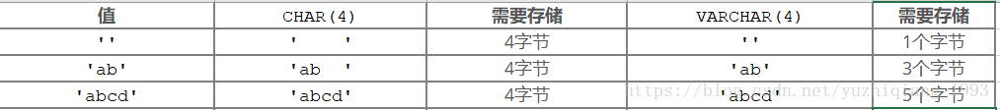

# MySQL 数据类型详解

- 简单 粗暴

### MySQL数据类型

- MySQL支持多种类型的SQL数据类型：数值，日期和时间类型，字符串（字符和字节）类型，空间类型和 JSON数据类型等 
- 数据类型描述使用以下约定：

- M表示整数类型的最大显示宽度。M表示整数类型的最大显示宽度。对于浮点和定点类型， M是可以存储的总位数（精度）。对于字符串类型， M是最大长度。允许的最大值M取决于数据类型。
- D适用于浮点和定点类型，并指示小数点后面的位数。最大可能值为30，但不应大于 M-2。
- [ ]表示类型定义的可选部分。


### 在MySQL中常用数据类型主要分为以下几类 
1. 数值类型 
2. 字符串类型 
3. 日期时间类型


### 约束条件
- 约束条件就是在给字段加一些约束，使该字段存储的值更加符合我们的预期。

[常用约束条件有以下这些]

- UNSIGNED ：无符号，值从0开始，无负数
- ZEROFILL：零填充，当数据的显示长度不够的时候可以使用前补0的效果填充至指定长度,字段会自动添加UNSIGNED
- NOT NULL：非空约束，表示该字段的值不能为空
- DEFAULT：表示如果插入数据时没有给该字段赋值，那么就使用默认值
- PRIMARY KEY：主键约束，表示唯一标识，不能为空，且一个表只能有一个主键。一般都是用来约束id
- AUTO_INCREMENT：自增长，只能用于数值列，而且配合索引使用,默认起始值从1开始，每次增长1
- UNIQUE KEY：唯一值，表示该字段下的值不能重复，null除外。比如身份证号是一人一号的，一般都会用这个进行约束
- FOREIGN KEY：外键约束，目的是为了保证数据的完成性和唯一性，以及实现一对一或一对多关系


### 数值类型

- 数值类型包括整数型、浮点型、定点型

- 整数型（精确值）

- TINYINT[(M)] [UNSIGNED] [ZEROFILL] 范围非常小的整数，有符号的范围是 -128到127，无符号的范围是0到 255

- SMALLINT[(M)] [UNSIGNED] [ZEROFILL] 范围较小的整数，有符号的范围是 -32768到32767，无符号的范围是0到 65535

- MEDIUMINT[(M)] [UNSIGNED] [ZEROFILL] 中等大小的整数，有符号的范围是 -8388608到8388607，无符号的范围是0到 16777215。

- INT[(M)] [UNSIGNED] [ZEROFILL] 正常大小的整数，有符号的范围是 -2147483648到 2147483647。无符号的范围是 0到4294967295。

- BIGINT[(M)] [UNSIGNED] [ZEROFILL] 大整数，有符号的范围是 -9223372036854775808到 9223372036854775807，无符号的范围是0到 18446744073709551615。




- 上面出现了两个词，有符号和无符号。 
- 我们来看看有符号和无符号（UNSIGNED）是啥玩意

- 在计算机中，可以区分正负的类型，称为有符号类型。无正负的类型，称为无符号类型。 
- 简单的理解为就是 
- 有符号值可以表示负数，0以及正数 
- 无符号值只能为0或正数

- 关于有符号和无符号详解可以看这篇文章或者自己百度百科。

- 这里我们就不关心原理了，我们只需要知道有符号数可以表示负数，无符号数只能为非负数即可，如果不手动指定UNSIGNED，那么默认就是有符号的

- 下面我们用一下整数型数据 
- 首先创建一个表


```mysql
CREATE TABLE int_db(
a TINYINT,
b SMALLINT,
c MIDDLEINT,
d INT,
e BIGINT
);
```

- 查看表结构

mysql> desc int_db;

| Field | Type         | Null | Key | Default | Extra |
|-|-|-|-|-|-|
| a     | tinyint(4)   | YES  |     | NULL    |       |
| b     | smallint(6)  | YES  |     | NULL    |       |
| c     | mediumint(9) | YES  |     | NULL    |       |
| d     | int(11)      | YES  |     | NULL    |       |
| e     | bigint(20)   | YES  |     | NULL    |       |

5 rows in set (0.02 sec)

mysql> 


- 我们来看看type这一列，可以看到，每个字段类型后面都有一个括号，括号里面的有个数值，这个数值实际上就是字段的显示宽度，也就是M的值，M表示整数类型的最大显示宽度。最大显示宽度为255.显示宽度与类型可包含的值范围无关

- 我们在创建表的时候并没有指定字段类型的显示宽度，那么，默认的显示宽度则是该字段类型最大的显示宽度

- 例如字段a的显示宽度为4，是因为TINYINT有符号值的范围是-128到127， 
- -128的长度为4（负号、1、2、8共四位），所以默认的显示宽度最大为4，其他的以此类推

- 下面我们再新建一个表，将字段a的修改为无符号类型的。再看看a字段的默认显示宽度 

mysql> desc  int_db1;

| Field | Type                | Null | Key | Default | Extra |
|-|-|-|-|-|-|
| a     | tinyint(3) unsigned | YES  |     | NULL    |       |
| b     | smallint(6)         | YES  |     | NULL    |       |
| c     | mediumint(9)        | YES  |     | NULL    |       |
| d     | int(11)             | YES  |     | NULL    |       |
| e     | bigint(20)          | YES  |     | NULL    |       |

5 rows in set (0.01 sec)

mysql>


- 可以看到，默认显宽度就变成3了，因为无符号的TINYINT的值范围为0-255，没有负号，所以最多是3位。

- ZEROFILL 
- 下面我们来试试ZEROFILL约束，前面的博客中我们知道。使用该约束后当数据的长度比我们指定的显示宽度小的时候会使用前补0的效果填充至指定长度,字段会自动添加UNSIGNED

- 下面我们新建个表试一下，这次我们来指定一下显示宽度

```mysql
CREATE TABLE int_db2(
a TINYINT(8) ZEROFILL,
b TINYINT(5) UNSIGNED);
```

- 然后插入一条记录：

```mysql
INSERT int_db2() VALUES(12,12);
```

mysql> desc  int_db2;

| Field | Type                         | Null | Key | Default | Extra |
|-|-|-|-|-|-|
| a     | tinyint(8) unsigned zerofill | YES  |     | NULL    |       |
| b     | tinyint(5) unsigned          | YES  |     | NULL    |       |

2 rows in set (0.00 sec)

mysql> 

- 可以看到，12变成了00000012，自动在前面补了0，这是因为指定的显示宽度是8，但是12只有两位，所以在前面补0，使长度为8。这就是ZEROFILL的效果

### 浮点型

  - FLOAT[(M,D)] [UNSIGNED] [ZEROFILL] 
  - 一个小的（单精度）浮点数。允许值是-3.402823466E+38 到-1.175494351E-38， 0以及1.175494351E-38 到3.402823466E+38,M是总位数，D是小数点后面的位数。
  - DOUBLE[(M,D)] [UNSIGNED] [ZEROFILL] 
  - 正常大小（双精度）浮点数。允许值是 -1.7976931348623157E+308到-2.2250738585072014E-308，0以及 2.2250738585072014E-308到 1.7976931348623157E+308。M是总位数，D是小数点后面的位数
- 下面我们来用一下浮点型 
- 创建表

```mysql
CREATE TABLE float_db(
a FLOAT(3,2),
b DOUBLE(5,3)
);
```

- 我们指定a字段为FLOAT类型，总长度为3，小数点后两位为2,b字段总长度为5，小数点后两位长度为3

mysql> desc float_db;

| Field | Type        | Null | Key | Default | Extra |
|-|-|-|-|-|-|
| a     | float(3,2)  | YES  |     | NULL    |       |
| b     | double(5,3) | YES  |     | NULL    |       |

2 rows in set (0.00 sec)

mysql> 


- 插入数据

```mysql
INSERT float_db VALUES(1.111,2.113);
```

mysql> select * from float_db;

| a    | b     |
|-|-|
| 1.11 | 2.113 |

1 row in set (0.00 sec)

mysql> 

- 可以看到，我们给a字段的值是1.111，但是只存进去了1.11 
- 浮点数存在精度丢失的问题，如果涉及到小数运算，尽量不要用浮点型

### 定点型

- DECIMAL[(M[,D])] [UNSIGNED] [ZEROFILL] 
- 常用于存储精确的小数，M是总位数，D是小数点后的位数。小数点和（负数） -符号不计入 M。如果 D为0，则值没有小数点或小数部分。最大位数（M）为 65. 最大支持小数（D）为30.如果D省略，则默认值为0.如果M省略，则默认值为10。M的范围是1到65。D范围为0到30，且不得大于M。
- 我们来用一下DECIMAL类型

- 首先创建表，先不指定M和D

```mysql 
CREATE TABLE decimal_db(a DECIMAL);
```
mysql> desc decimal_db;

| Field | Type          | Null | Key | Default | Extra |
|-|-|-|-|-|-|
| a     | decimal(10,0) | YES  |     | NULL    |       |

1 row in set (0.01 sec)

mysql> 


- 可以看到，默认的总长度（M）为10，小数点位数(D)默认为0.
- 插入一条数据

```mysql
INSERT decimal_db VALUES(30.556)
```

mysql> select * from decimal_db;

| a    |
|-|
|   31 |

1 row in set (0.00 sec)

mysql> 


- 可以看到，存进去的数值被四舍五入阶段了，也就是说，DECIMAL也在存储时存在精度丢失的问题。

- 超出范围和溢出处理

- 当MySQL将值存储在超出列数据类型允许范围的数值列中时，结果取决于当时生效的SQL模式： 
- 如果启用了严格的SQL模式，则MySQL会根据SQL标准拒绝带有错误的超出范围的值，并且插入失败。 
- 如果未启用限制模式，MySQL会将值截断到列数据类型范围的相应端点，并存储结果值，并产生一个警告

- 在我们的配置文件中可以看到SQL模式的配置，关于SQL模式详情请看SQL模式官方文档




### 字符串类型
- 常用的字符串类型有如下

- CHAR[(M)] 一个固定长度的字符串，在存储时始终用空格填充指定长度。 M表示以字符为单位的列长度。M的范围为0到255.如果M省略，则长度为1，存储时占用M个字节
- VARCHAR(M)可变长度的字符串，M 表示字符的最大列长度，M的范围是0到65,535，存储时占用L+1（L<=M,L为实际字符的长度）个字节
- TINYTEXT[(M)] 不能有默认值，占用L+1个字节，L<2^8
- TEXT[(M)] 不能有默认值，占用L+2个字节，L<2^16
- MEDIUMTEXT[(M)] 不能有默认值，占用L+3个字节，L<2^24
- LONGTEXT[(M)] 不能有默认值，占用L+4个字节，L<2^32
- ENUM('value1','value2',...) ENUM是一个字符串对象，其值从允许值列表中选择，它只能有一个值，从值列表中选择,最多可包含65,535个不同的元素
- SET('value1','value2',...) 字符串对象，该对象可以有零个或多个值，最多可包含64个不同的成员

- CHAR和VARCHAR

- 创建表

```mysql
CREATE TABLE str_db(
a CHAR(4),
b VARCHAR(4));
```

- 插入数据

```mysql
INSERT str_db() VALUES("","");
INSERT str_db() VALUES("ab","ab");
INSERT str_db() VALUES("abcd","abcd");
INSERT str_db() VALUES("abcdefg","abcdefg");//在严格模式下，改条数据会插入失败，非严格模式则会对数据进行截取
```

mysql> select * from str_db;

| a    | b    |
|-|-|
|      |      |
| ab   | ab   |
| abcd | abcd |

3 rows in set (0.01 sec)

mysql> 


- 我们看到查询的结果是一样的，但实际上他们存储时占用的长度是不一样的。 
- CHAR类型不管存储的值的长度是多少，都会占用M个字节，而VARCHAR则占用实际长度+1个字节。





- 但是CHAR的查询效果要高于VARCHAR，所以说，如果字段的长度能够确定的话，比如手机号，身份证号之类的字段，可以用CHAR类型，像地址，邮箱之类的就用VARCHAR

- TEXT系列

- TEXT系列的存储范围比VARCHAR要大，当VARCHAR不满足时可以用TEXT系列中的类型。需要注意的是TEXT系列类型的字段不能有默认值，在检索的时候不存在大小写转换，没有CHAR和VARCHAR的效率高

```mysql
mysql> create str1_db(a TINYTEXT default 'qq');
ERROR 1064 (42000): You have an error in your SQL syntax; check the manual that corresponds to your MySQL server version for the right syntax to use near 'str1_db(a TINYTEXT default 'qq')' at line 1
mysql> 
```

### ENUM 枚举类型 
- 创建表

```mysql
CREATE TABLE enum_db(gender ENUM("男","女"));
```

mysql> desc enum_db;

| Field  | Type              | Null | Key | Default | Extra |
|-|-|-|-|-|-|
| gender | enum('男','女')   | YES  |     | NULL    |       |

1 row in set (0.00 sec)

mysql>

- 插入数据

```mysql
INSERT enum_db() VALUES("男");
INSERT enum_db() VALUES(1); 也可以使用编号插入值，等同于"男"，序号从1开始
INSERT enum_db() VALUES("女");
INSERT enum_db() VALUES(2);等同于"女"
```

mysql> select * from enum_db;

| gender |
|-|
| 男     |
| 男     |
| 女     |
| 女     |

3 rows in set (0.00 sec)

mysql> 


- 下面我们插入一条不是枚举集合中的数据试一下

```mysql
mysql> 
mysql> INSERT enum_db() VALUES("杨过");
ERROR 1265 (01000): Data truncated for column 'gender' at row 1
mysql> 
```
- 可以看到是插入失败的

### SET

- 在ENUM中我们只能从允许值列表中给字段插入一个值，而在SET类型中可以给字段插入多个值

- 创建表

```mysql
CREATE TABLE set_db(
a SET('1','2','3','4','5')
);
```

mysql> desc set_db;

| Field | Type                     | Null | Key | Default | Extra |
|-|-|-|-|-|-|
| a     | set('1','2','3','4','5') | YES  |     | NULL    |       |

1 row in set (0.00 sec)

mysql> 

- 插入数据

```mysql
INSERT set_db() VALUES('1');
INSERT set_db() VALUES('1,2,3');
```

mysql> select * from set_db;

| a     |
|-|
| 1     |
| 1,2,3 |

2 rows in set (0.00 sec)

mysql>


### 日期时间类型
 - 
   - TIME 范围是’-838:59:59.000000’ 到’838:59:59.000000’
   - DATE 支持的范围是 ‘1000-01-01’到 ‘9999-12-31’
   - DATETIME 日期和时间组合。支持的范围是 ‘1000-01-01 00:00:00.000000’到 ‘9999-12-31 23:59:59.999999’。
   - TIMESTAMP 时间戳。范围是’1970-01-01 00:00:01.000000’UTC到’2038-01-19 03:14:07.999999’UTC。
   - YEAR 范围是 1901到2155

- TIME

- 我们可以看到TIME的存储范围是’-838:59:59’到 ‘838:59:59’，因为TIME类型不仅可以用于表示一天中的时间（，还可以用于表示两个事件之间的经过时间或时间间隔

  - TIME的完整的显示为 D HH:MM:SS 
  - D：表示天数，当指定该值时，存储时小时会先乘以该值 
  - HH：表示小时 
  - MM：表示分钟 
  - SS:表示秒

创建表：


```mysql
CREATE TABLE time_db(
a TIME
);
```

- 插入值：

```mysql
INSERT time_db() VALUES('22:14:16');
   
INSERT time_db() VALUES('-2 22:14:16'); // -2表示间隔了2两天

INSERT time_db() VALUES('14:16');       // 有冒号从小时开始

INSERT time_db() VALUES('30');         //  没有冒号且没有天数则数据从秒开始

INSERT time_db() VALUES('3 10');       //  有天数也从小时开始 

INSERT time_db() VALUES(253621);       //  直接使用数字代替也可以 
```


mysql> select * from time_db;

| a         |
|-|
| 22:14:16  |
| -70:14:16 |
| 14:16:00  |
| 00:00:30  |
| 82:00:00  |
| 25:36:21  |

6 rows in set (0.00 sec)

mysql> 

### DATE

- 创建表

```mysql
CREATE TABLE date_db( 
a DATE);
```

- 插入数据

```mysql
INSERT date_db() VALUES("20180813"); 
INSERT date_db() VALUES("2018-06-1"); 
INSERT date_db() VALUES("2018-4-1"); 
INSERT date_db() VALUES("2018-04-07");
```


mysql> select * from date_db;

| a          |
|-|
| 2018-08-13 |
| 2018-06-01 |
| 2018-04-01 |
| 2018-04-07 |

4 rows in set (0.00 sec)

mysql> 


### DATETIME

- 创建表

```mysql
CREATE TABLE datetime_db(
a DATETIME
);
```

- 插入数据

```mysql
INSERT datetime_db() VALUES(20180102235432);
INSERT datetime_db() VALUES("2015-04-21 21:14:32");
INSERT datetime_db() VALUES("2015-04-23");
```

mysql> select * from datetime_db;

| a                   |
|-|
| 2018-01-02 23:54:32 |
| 2015-04-21 21:14:32 |
| 2015-04-23 00:00:00 |

3 rows in set (0.00 sec)

mysql> 


### TIMESTAMP

- 在创建时间字段的时候

- DEFAULT CURRENT_TIMESTAMP
- 表示当插入数据的时候，该字段默认值为当前时间

- ON UPDATE CURRENT_TIMESTAMP
- 表示每次更新这条数据的时候，该字段都会更新成当前时间

- 这两个操作是mysql数据库本身在维护，所以可以根据这个特性来生成【创建时间】和【更新时间】两个字段，且不需要代码来维护

- 如下：

```mysql
CREATE TABLE `mytest` (
    `text` varchar(255) DEFAULT '' COMMENT '内容',
    `create_time` timestamp NOT NULL DEFAULT CURRENT_TIMESTAMP COMMENT '创建时间',
    `update_time` timestamp NOT NULL DEFAULT CURRENT_TIMESTAMP ON UPDATE CURRENT_TIMESTAMP COMMENT '更新时间'
) ENGINE=InnoDB DEFAULT CHARSET=utf8;
```

- 创建表

```mysql
CREATE TABLE timestamp_db(
a TIMESTAMP
);
```

- 插入数据

```mysql
INSERT timestamp_db() VALUES(20020121);
INSERT timestamp_db() VALUES(20020121142554);
INSERT timestamp_db() VALUES("2015-12-16 21:14:15");
INSERT timestamp_db() VALUES("2015-12-17");
INSERT timestamp_db() VALUES(NULL);
INSERT timestamp_db() VALUES(CURRENT_TIMESTAMP);
INSERT timestamp_db() VALUES();
```


### YEAR

- 创建表
```mysql
CREATE TABLE year_db(
a YEAR
);
```

- 插入数据

```mysql
INSERT year_db() VALUES("1993");
INSERT year_db() VALUES(1993);
```


mysql> select * from year_db;

| a    |
|-|
| 1993 |
| 1993 |

2 rows in set (0.00 sec)

mysql> 


### 整型

- 先从最基本的数据类型整型说起，首先用一张表格归纳一下：

| 数据类型 | 字节数 |     带符号最小值       |     带符号最大值    | 不带符号最小值 | 不带符号最大值        |
|-|-|-|-|-|-|
| TINYINT |    1   |      -128             |     127             |      0        |      255             |
| SMALLINT |   2   |     -32768            |    32767            |      0        |     65535            |
| MEDIUMINT|   3   |    -8388608           |   8388607           |      0        |    16777215          |
| INT      |   4   |   -2147483648         |  2147483647         |      0        |   4294967295         | 
| BIGINT   |   8   | -9223372036854775808  | 9223372036854775807 |      0        | 18446744073709551616 |

- 即使是带符号的BIGINT，其实也已经是一个天文数字了，什么概念，9223372036854775807我们随便举下例子：

- 以byte为例可以表示8589934592GB-->8388608TB-->8192PB
- 以毫秒为例可以表示292471208年
- 所以从实际开发的角度，我们一定要为合适的列选取合适的数据类型，即到底用不用得到这种数据类型？举个例子：

- 一个枚举字段明明只有0和1两个枚举值，选用TINYINT就足够了，但在开发场景下却使用了BIGINT，这就造成了资源浪费
- 简单计算一下，假使该数据表中有100W数据，那么总共浪费了700W字节也就是6.7M左右，如果更多的表这么做了，那么浪费的更多
- 要知道，MySQL本质上是一个存储，以Java为例，可以使用byte类型的地方使用了long类型问题不大，因为绝大多数的对象在程序中都是短命对象，方法执行完毕这块内存区域就被释放了，7个字节实际上不存在浪不浪费一说。但是MySQL作为一个存储，8字节的BIGINT放那儿就放那儿了，占据的空间是实实在在的。


### 枚举类型与集合类型

- 字段的值只能在给定范围中选择，如单选框，多选框

- enum 单选 只能在给定的范围内选一个值，如性别 sex 男male/女female

- set 多选 在给定的范围内可以选择一个或一个以上的值（爱好1,爱好2,爱好3...）


```mysql
CREATE TABLE `user` (
  `id` int(11) NOT NULL AUTO_INCREMENT COMMENT '我是id',
  `name` varchar(50) CHARACTER SET utf8mb4 COLLATE utf8mb4_general_ci DEFAULT NULL COMMENT '我是名字',
  `password` varchar(80) CHARACTER SET utf8mb4 COLLATE utf8mb4_general_ci DEFAULT NULL COMMENT '我是密码',
  `img` varchar(255) CHARACTER SET utf8mb4 COLLATE utf8mb4_general_ci DEFAULT NULL COMMENT '我是头像',
  `sex` enum('male','female') CHARACTER SET utf8mb4 COLLATE utf8mb4_general_ci DEFAULT NULL COMMENT '我是性别', #在指定范围内，多选一
  `level` enum('vip1','vip2','vip3','vip4','vip5') CHARACTER SET utf8mb4 COLLATE utf8mb4_general_ci DEFAULT NULL COMMENT '我是水平', #在指定范围内，多选一
  `hobby` set('play','music','read','study') CHARACTER SET utf8mb4 COLLATE utf8mb4_general_ci DEFAULT NULL COMMENT '我是爱好', #在指定范围内，多选多
  `mail` varchar(60) CHARACTER SET utf8mb4 COLLATE utf8mb4_general_ci DEFAULT NULL COMMENT '我是邮箱',
  `address` varchar(255) CHARACTER SET utf8mb4 COLLATE utf8mb4_general_ci DEFAULT NULL COMMENT '我是地址',
  `utime` datetime DEFAULT NULL COMMENT '我是创建时间',
  `ctime` datetime DEFAULT NULL COMMENT '我是修改时间',
  PRIMARY KEY (`id`),
  UNIQUE KEY `name` (`name`),
  UNIQUE KEY `mail` (`mail`)
) ENGINE=InnoDB DEFAULT CHARSET=utf8mb4 COLLATE=utf8mb4_general_ci;
```


```mysql
insert into `user` values 
(null, '小明', '123456', 'b.png', 'female', 'vip3', 'music,music', 'xiaoming@163.com', '上海世纪佳缘俱乐部', '20180102235432','2015-04-21 21:14:32'), 
(null, '小林', '123456', 'c.png', 'male', 'vip5', 'music,read', 'xiaolin@163.com', '广东拳击俱乐部', '20180102235432','2015-04-21 21:14:32'), 
(null, '小王', '123456', 'd.png', 'female', 'vip2', 'play,study', 'xiaowang@163.com', '东北老干妈俱乐部', '20180102235432','2015-04-21 21:14:32');
```


--------------------- 
作者：UFO

原文：https://github.com/lidawei-ufo/MYSQL/blob/master/MySQL%20%E6%95%B0%E6%8D%AE%E7%B1%BB%E5%9E%8B%E8%AF%A6%E8%A7%A3.md

版权声明：本文为博主原创文章，转载请附上博文链接！


