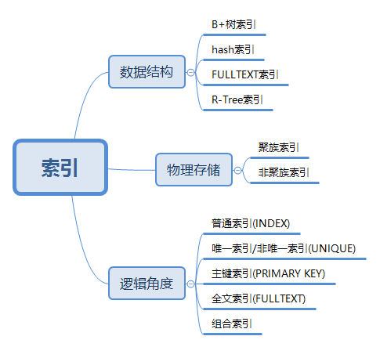

### mysql  优化

- 不要查询不需要的列

- 不要在多表关联返回全部的列

- 不要select *

- 不要重复查询，应当写入缓存

- 尽量使用关联查询来替代子查询。

- 尽量使用索引优化。如果不使用索引。mysql则使用临时表或者文件排序。如果不关心结果集的顺序，可以使用order by null 禁用文件排序。

- 优化分页查询，最简单的就是利用覆盖索引扫描。而不是查询所有的列

- 应尽量避免在 where 子句中使用 !=或<> 操作符，否则将引擎放弃使用索引而进行全表扫描。

- 对查询进行优化，应尽量避免全表扫描，首先应考虑在 where 及 order by 涉及的列上建立索引

- 应尽量避免在 where 子句中对字段进行 null 值判断，否则将导致引擎放弃使用索引而进行全表扫描，如：

```sql
select * from user where name is null
```

- 尽量不要使用前缀%

```sql
select * from user where name like '%a'
```

- 应尽量避免在 where 子句中对字段进行表达式操作

- 应尽量避免在where子句中对字段进行函数操作，这将导致引擎放弃使用索引而进行全表扫描

- 很多时候用 exists 代替 in 是一个好的选择


### 常见索引

#### 索引概念

索引是存储引擎用于快速找到记录的一种数据结构

#### 索引分类



#### 索引创建

```mysql
ALTER TABLE `table_name` ADD INDEX index_name (`column`); #普通索引
```

```mysql
ALTER TABLE `table_name` ADD UNIQUE (`column`); #唯一索引
```

```mysql
ALTER TABLE `table_name` ADD PRIMARY KEY (`column`); #主键索引
```

```mysql
ALTER TABLE `table_name` ADD FULLTEXT (`column`); #全文索引
```

```mysql
ALTER TABLE `table_name` ADD INDEX index_name (`column1`, `column2`, `column3`); #组合索引
```

#### 索引区别

- 普通索引：最基本的索引，没有任何限制
- 唯一索引：与"普通索引"类似，不同的就是：索引列的值必须唯一，但允许有空值
- 主键索引：它是一种特殊的唯一索引，不允许有空值
- 全文索引：仅可用于 MyISAM 表，针对较大的数据，生成全文索引很耗时好空间
- 组合索引：为了更多的提高 MySQL 效率可建立组合索引，遵循"最左前缀"原则

### 聚族索引与非聚族索引的区别

- 按物理存储分类：聚簇索引(clustered index)、非聚簇索引(non-clustered index)
- 聚簇索引的叶子节点就是数据节点，而非聚簇索引的叶子节点仍然是索引节点，只不过有指向对应数据块的指针

## btree索引

B-TREE索引适合全键值、键值范围、前缀查找。

全值匹配，是匹配所有的列进行匹配、

匹配最左前缀。比如 a=1&b=2 那么会用到a的索引

匹配列前缀。 比如 abc abcd %abc

匹配范围 比如 in(3,5)

### 限制

- 如果不是左前缀开始查找，无法使用索引 比如 %aa 

- 不能跳过索引的列。

- 需要中，含有某个列的范围查找，后面的所有字段都不会用到索引

### 索引的优点

1、减少服务器扫描表的次数

2、避免排序和临时表

3、将随机io变成顺序io

### 高性能索引策略

- 1、使用独立的列，而不是计算的列

where num+1 =10 //bad

where num = 9 //good

- 2、使用前缀索引
- 3、多列索引，应该保证左序优先
- 4、覆盖索引
- 5、选择合适的索引顺序

不考虑排序和分组的情况。在选择性最高的列上，放索引，

- 6、使用索引扫描来排序

mysql有两种方式生成有序的结果，一种是排序操作，一种是按索引顺序扫描，如果explain处理的type列的值是index。则说明mysql使用了索引

只有当索引的列顺序和order by子句的顺序一致的时候，并且所有的顺序都一致的时候。mysql才能使用索引进行排序。

### 不能使用索引的情况

- 1.查询使用了两种排序方向

```sql
select * from user where login_time > '2018-01-01' order by id des ,username asc #
```

- 2.order by中含有了一个没有 索引的列

```sql
select * from user where name = '11' order by age desc; //age 没有索引
```

- 3.where 和 order by 无法形成最左前缀

- 索引列的第一列是范围条件

- 在索引列上有多个等于条件，这也是一种范围。不能使用索引

https://blog.csdn.net/samjustin1/article/details/52212421


DROP PROCEDURE IF EXISTS proc_initData;
DELIMITER $
CREATE PROCEDURE proc_initData()
BEGIN
DECLARE i INT DEFAULT 1;
WHILE i<=10000 DO
    INSERT INTO test(a,b,c,d) VALUES(i,i,i,i);
    SET i = i+1;
END WHILE;
END $
CALL proc_initData();


### 分表数量级

MySQL 单表容量在`500万`左右，性能处于最佳状态，此时，MySQL 的 BTREE 索引树高在3～5之间

### EXPLAIN 输出格式

|Column|JSON Name|含义|
|-|-|-|
|id|select_id|SELECT 标识符|
|select_type|None|SELECT 类型|
|table|table_name|输出行描述的表的表名|
|partitions|partitions|匹配的分区|
|type|access_type|连接类型|
|possible_keys|possible_keys|可供选择使用的索引|
|key|key|实际使用的索引|
|key_len|key_length|实际使用的索引的长度|
|ref|ref|与索引进行比较的列，也就是关联表使用的列|
|rows|rows|将要被检查的估算的行数|
|filtered|filtered|被表条件过滤的行数的百分比|
|Extra|None|附件信息|


### type - 重要
- type :这是重要的列，显示连接使用了何种类型.从最好到最差的连接类型为const(常数查找 一般用于主键,唯一索引)、eq_reg(范围查找 一般用于主键,唯一索引)、ref(比较常见于连接的查询中 一个表基于某一个索引的查找)、range(索引的范围查找)、index(通常是对索引的扫描)和all(all:表扫描)。
systme>const>eq_ref>ref>fulltext>ref_or_null>index_merge>unique_subquery>index_subquery>range>index>all

|参数|含义|
|-|-|
|system|表仅有一行,这是const类型的特列,平时不会出现,这个也可以忽略不计|
|const|表最多有一个匹配行,const用于比较primary key 或者unique索引只匹配一行数据情况下才会是const|
|eq_ref|对于每个来自于前面的表的行组合,从该表中读取一行.这可能是最好的联接类型,除了const类型.它用在一个索引的所有部分被联接使用并且索引是UNIQUE或PRIMARY KEY,eq_ref可以用于使用=比较带索引的列,需要说明的是uid在这两个表中都是primary. explain select * from uchome_spacefield,uchome_space where uchome_spacefield.uid = uchome_space.uid|
|ref|对于每个来自于前面的表的行组合,所有有匹配索引值的行将从这张表中读取.如果联接只使用键的最左边的前缀,或如果键不是UNIQUE或PRIMARY KEY(换句话说,如果联接不能基于关键字选择单个行的话),则使用ref.如果使用的键仅仅匹配少量行,该联接类型是不错的|
|range|给定范围内的检索,使用一个索引来检查行.看下面两条语句,explain select * from uchome_space where uid in (1,2).explain select * from uchome_space where groupid in (1,2).uid有索引，groupid没有索引，结果是第一条语的联接类型是range,第二个是ALL.是一定范围所以说像 between也可以这种联接,explain select * from uchome_space where friendnum = 17,这样的语句是不会使用range的，它会使用更好的联接类型就是上面介绍的ref|
|index|该联接类型与ALL相同,除了只有索引树被扫描.这通常比ALL快,因为索引文件通常比数据文件小.(也就是说虽然all和Index都是读全表,但index是从索引中读取的,而all是从硬盘中读的)当查询只使用作为单索引一部分的列时,MySQL可以使用该联接类型|
|ALL|对于每个来自于先前的表的行组合,进行完整的表扫描.如果表是第一个没标记const的表,这通常不好,并且通常在它情况下很差.通常可以增加更多的索引而不要使用ALL,使得行能基于前面的表中的常数值或列值被检索出|
|possible_ keys|显示可能应用在这张表中的索引.如果为空,没有可能的素引|
|key|实际使用的索引.如果为null,则没有使用索引.很少的情况下,mysql会选择优化不足的索引.这种情况下,可以在select语句中使用use index(indexname)来强制使用一个索引或者用ignore index(indexname)来强制mysql忽略索引|	
|key_len|使用的索引的长度.在不损失精确性的情况下,长度越短越好|
|ref|显示索引的哪一列被使用了,如果可能的话,是一个常数(ref列显示使用哪个列或常数与key一起从表中选择行)|
|rows|显示MYSQL执行查询的行数,简单且重要,数值越大越不好,说明没有用好索引|

--extra列需要注意的返回值

|参数|含义|
|-|-|
|Using filesort|[使用了文件排序] 看到这个的时候,查询就需要优化了.MYSQL需要进行额外的步骤来发现如何对返回的行排序.它根据连接类型以及存储排序键值和匹配条件的全部行的行指针来排序全部行|
|Using temporary|[使用了临时表]看到这个的时候,查询需要优化了.这里,MYSQL需要创建-个临时表来存储结果,这通常发生在对不同的列集进行ORDER BY上,而不是GROUP BY上|

- count(*):会列出所有查询的行数 包括空值 
- count(id):只查询符合要求的不包括空值 


### mysql索引最左匹配原则的理解

- 创建表

```sql
create table test(
a int ,
b int,
c int,
d int,
key index_abc(a,b,c)
)engine=InnoDB default charset=utf8;
```
- 插入 10000 条数据
```sql
DROP PROCEDURE IF EXISTS proc_initData;
DELIMITER $
CREATE PROCEDURE proc_initData()
BEGIN
DECLARE i INT DEFAULT 1;
WHILE i<=10000 DO
    INSERT INTO test(a,b,c,d) VALUES(i,i,i,i);
    SET i = i+1;
END WHILE;
END $
CALL proc_initData();
```
- 建立了联合索引（a，b，c）

- 验证:[explain 指令详解可以查看](https://www.cnblogs.com/gomysql/p/3720123.html)
```sql
explain select * from test where a<10 ;
```
```sql
explain select * from test where a<10 and b <10;
```
```sql
explain select * from test where a<10 and b <10 and c<10;
```
```sql
能不能将 a，b出现顺序换一下，a，b，c出现顺序换一下
```
```sql
explain select * from test where b<10 and a <10;
```
```sql
explain select * from test where b<10 and a <10 and c<10;
```
- 不是最左匹配原则吗？

- 查了下资料发现:mysql查询优化器会判断纠正这条sql语句该以什么样的顺序执行效率最高,最后才生成真正的执行计划.所以,当然是我们能尽量的利用到索引时的查询顺序效率最高咯,所以mysql查询优化器会最终以这种顺序进行查询执行.

### 重点来了
```sql
explain select * from test where b<10 and c <10;
```
```sql
explain select * from test where a<10 and c <10;
```
- 为什么 b<10 and c <10,没有用到索引?而 a<10 and c <10用到了？

总结 : 当b+树的数据项是复合的数据结构,比如(name,age,sex)的时候,b+数是按照从左到右的顺序来建立搜索树的,比如当(张三,20,F)这样的数据来检索的时候,b+树会优先比较name来确定下一步的所搜方向,如果name相同再依次比较age和sex,最后得到检索的数据;但当(20,F)这样的没有name的数据来的时候,b+树就不知道下一步该查哪个节点,因为建立搜索树的时候name就是第一个比较因子,必须要先根据name来搜索才能知道下一步去哪里查询.比如当(张三,F)这样的数据来检索时,b+树可以用name来指定搜索方向,但下一个字段age的缺失,所以只能把名字等于张三的数据都找到,然后再匹配性别是F的数据了,这个是非常重要的性质,即索引的最左匹配特性.

--------------------- 
作者：UFO

原文：https://github.com/lidawei-ufo/MYSQL/blob/master/mysql%E4%BC%98%E5%8C%96.md

版权声明：本文为博主原创文章，转载请附上博文链接！


