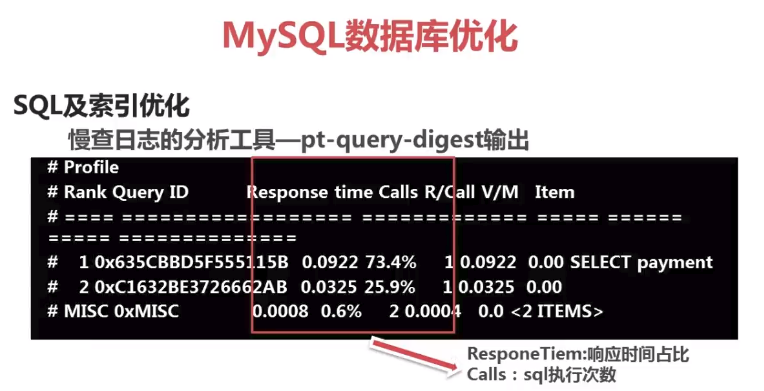
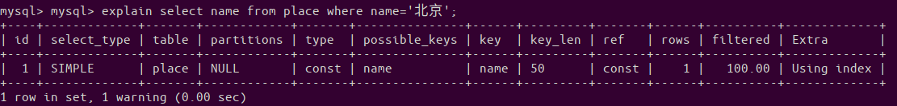
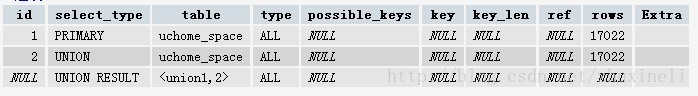
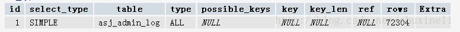
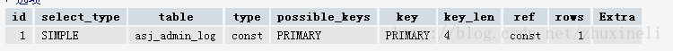
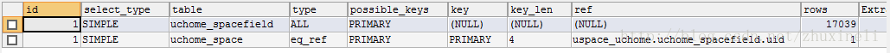
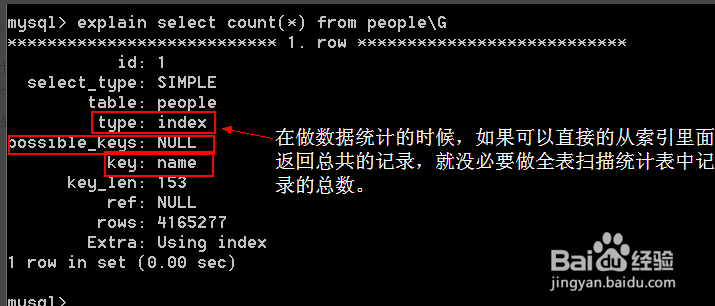
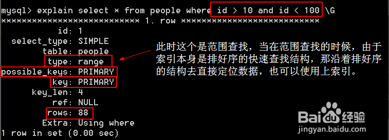
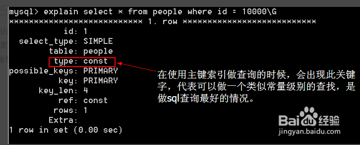

# 慢日志 pt-query-digest

* 修改 mysql 的配置文件

```mysql
1、修改 mysql 的配置文件 my.cnf：

vi /etc/mysql/my.cnf

2、在 [mysqld] 中添加内容：

slow_query_log=TRUE                                    #开启慢日志
slow_query_log_file=/var/log/mysql/mysql-slow.log      #日志存放位置
long_query_time=5                                      #超时时间5秒（超过5秒就会被记录下来）

3、登录 mysql 客户端，查看 slow_query_log 变量：

show variables like '%quer%';
```

**pt-query-digest**

### 查看

sudo pt-query-digest /var/web/log/mysql-slow.log


```mysql
# 250ms user time, 20ms system time, 34.06M rss, 100.20M vsz
# Current date: Tue Apr 30 08:29:10 2019
# Hostname: lidawei-TM1703
# Files: /var/web/log/mysql-slow.log
# Overall: 2 total, 2 unique, 0.40 QPS, 0.00x concurrency ________________
# Time range: 2019-04-30T00:10:35 to 2019-04-30T00:10:40
# Attribute          total     min     max     avg     95%  stddev  median
# ============     ======= ======= ======= ======= ======= ======= =======
# Exec time           20ms   237us    20ms    10ms    20ms    14ms    10ms
# Lock time           20ms       0    20ms    10ms    20ms    14ms    10ms
# Rows sent             47       1      46   23.50      46   31.82   23.50
# Rows examine          46       0      46      23      46   32.53      23
# Query size           196      31     165      98     165   94.75      98

# Profile
# Rank Query ID                          Response time Calls R/Call V/M
# ==== ================================= ============= ===== ====== =====
#    1 0x4907241E0AA5EE47DB8A8CC893C6...  0.0202 98.8%     1 0.0202  0.00 SELECT
z_course_collect
# MISC 0xMISC                             0.0002  1.2%     1 0.0002   0.0 <1 ITE
MS>

--更多--
```

****
Rows sent   >   Rows examine [说明索引优化好 反之 就搜索时全盘扫描大于定向搜索]


* a. 标准分析报告解释

```mysql
Overall: 总共有多少条查询，
Time range: 查询执行的时间范围。
unique: 唯一查询数量，即对查询条件进行参数化以后，总共有多少个不同的查询
total: 总计   min:最小   max: 最大  avg:平均
95%: 把所有值从小到大排列，位置位于95%的那个数，这个数一般最具有参考价值。
median: 中位数，把所有值从小到大排列，位置位于中间那个数。
```

* b. 查询分组统计结果,如下图



```mysql
由上图可见，这部分对查询进行参数化并分组，然后对各类查询的执行情况进行分析，结果按总执行时长，从大到小排序。
Response: 总的响应时间。
time: 该查询在本次分析中总的时间占比。
calls: 执行次数，即本次分析总共有多少条这种类型的查询语句。
R/Call: 平均每次执行的响应时间。
Item : 查询对象
```
* c. 每一种查询的详细统计结果

```mysql
最上面的表格列出了执行次数、最大、最小、平均、95%等各项目的统计。
Databases: 库名
Users: 各个用户执行的次数（占比）
Query_time distribution : 查询时间分布, 长短体现区间占比，本例中1s-10s之间查询数量是10s以上的两倍。
Tables: 查询中涉及到的表
```
* Explain: 示例

**用法示例**

```mysql
(1)直接分析慢查询文件:
pt-query-digest  slow.log > slow_report.log
```
```mysql
(2)分析最近12小时内的查询：
pt-query-digest  --since=12h  slow.log > slow_report2.log
```
```mysql
(3)分析指定时间范围内的查询：

pt-query-digest slow.log --since '2014-04-17 09:30:00' --until '2014-04-17 10:00:00'> > slow_report3.log
```
```mysql
(4)分析指含有select语句的慢查询
pt-query-digest--filter '$event->{fingerprint} =~ m/^select/i' slow.log> slow_report4.log
```
```mysql
(5) 针对某个用户的慢查询
pt-query-digest--filter '($event->{user} || "") =~ m/^root/i' slow.log> slow_report5.log
```
```mysql
(6) 查询所有所有的全表扫描或full join的慢查询
pt-query-digest--filter '(($event->{Full_scan} || "") eq "yes") ||(($event->{Full_join} || "") eq "yes")' slow.log> slow_report6.log
```
```mysql
(7)把查询保存到query_review表
pt-query-digest  --user=root –password=abc123 --review  h=localhost,D=test,t=query_review--create-review-table  slow.log
```
```mysql
(8)把查询保存到query_history表
pt-query-digest  --user=root –password=abc123 --review  h=localhost,D=test,t=query_ history--create-review-table  slow.log_20140401
pt-query-digest  --user=root –password=abc123--review  h=localhost,D=test,t=query_history--create-review-table  slow.log_20140402
```
```mysql
(9)通过tcpdump抓取mysql的tcp协议数据，然后再分析
tcpdump -s 65535 -x -nn -q -tttt -i any -c 1000 port 3306 > mysql.tcp.txt
pt-query-digest --type tcpdump mysql.tcp.txt> slow_report9.log
```
```mysql
(10)分析binlog
mysqlbinlog mysql-bin.000093 > mysql-bin000093.sql
pt-query-digest  --type=binlog  mysql-bin000093.sql > slow_report10.log
```
```mysql
(11)分析general log
pt-query-digest  --type=genlog  localhost.log > slow_report11.log
```

* 输出到文件

sudo pt-query-digest   /var/web/log/mysql-slow.log  >slow_log.report


**mysql数据库优化**

```mysql
a. 查询次数多且每次查询占用时间长的sql
通常是pt-query-digest分析前几个
```
```mysql
b. IO 大的 SQL
注意pt-query-digest 分析中的 Rows  examine 项
```
```mysql
c. 未命中索引的SQL
注意pt-query-digest 分析中 Rows examine 和 Rows Send 的对比
```
```mysql
d.如何分析SQL查询explain返回各列的含义
```



**explain列的解释**

```mysql
select_type

select类型，它有以下几种值
simple 它表示简单的select,没有union和子查询
primary 最外面的select,在有子查询的语句中，最外面的select查询就是primary,上图中就是这样
union union语句的第二个或者说是后面那一个.现执行一条语句，explain
select * from uchome_space limit 10 union select * from uchome_space limit 10,10
会有如下结果
```




```mysql
第二条语句使用了union
dependent union UNION中的第二个或后面的SELECT语句，取决于外面的查询
union result   UNION的结果,如上面所示
还有几个参数，这里就不说了，不重要
```

**table:显示这一行的数据是关于哪张表的**

* type:这是重要的列,显示连接使用了何种类型.从最好到最差的连接类型为
```mysql
const(常数查找 一般用于主键,唯一索引)

eq_reg(范围查找 一般用于主键,唯一索引)

ref(比较常见于连接的查询中 一个表基于某一个索引的查找)

range(索引的范围查找)

index(通常是对索引的扫描)和all(all:表扫描)。
```

systme>const>eq_ref>ref>fulltext>ref_or_null>index_merge>unique_subquery>index_subquery>range>index>all**


```mysql
*system:表仅有一行，这是const类型的特列，平时不会出现，这个也可以忽略不计
```

```mysql
*const:表最多有一个匹配行，const用于比较primary key 或者unique索引。因为只匹配一行数据，所以很快
记住一定是用到primary key 或者unique，并且只检索出两条数据的 情况下才会是const,看下面这条语句
explain SELECT * FROM `asj_admin_log` limit 1,结果是
```




```mysql
虽然只搜索一条数据，但是因为没有用到指定的索引，所以不会使用const.继续看下面这个
explain SELECT * FROM `asj_admin_log` where log_id = 111
```



```mysql
log_id是主键，所以使用了const。所以说可以理解为const是最优化的
```

```mysql
*eq_ref:对于eq_ref的解释，mysql手册是这样说的:"对于每个来自于前面的表的行组合,从该表中读取一行。这可能是最好的联接类型,
除了const类型.它用在一个索引的所有部分被联接使用并且索引是UNIQUE或PRIMARY KEY".eq_ref可以用于使用=比较带索引的列.看下
面的语句
explain select * from uchome_spacefield,uchome_space where uchome_spacefield.uid = uchome_space.uid
得到的结果是下图所示。很明显，mysql使用eq_ref联接来处理uchome_space表。
```



```mysql
目前的疑问：
为什么是只有uchome_space一个表用到了eq_ref,并且sql语句如果变成
explain select * from uchome_space,uchome_spacefield where uchome_space.uid = uchome_spacefield.uid
结果还是一样，需要说明的是uid在这两个表中都是primary
```

```mysql
*ref:对于每个来自于前面的表的行组合,所有有匹配索引值的行将从这张表中读取.如果联接只使用键的最左边的前缀,或如果键不是UNIQUE
或PRIMARY KEY(换句话说,如果联接不能基于关键字选择单个行的话)则使用ref.如果使用的键仅仅匹配少量行,该联接类型是不错的.看下面
这条语句 explain select * from uchome_space where uchome_space.friendnum = 0,得到结果如下,这条语句能搜出1w条数据
```


```mysql
*range:给定范围内的检索，使用一个索引来检查行。看下面两条语句
explain select * from uchome_space where uid in (1,2)
explain select * from uchome_space where groupid in (1,2)
uid有索引,groupid没有索引,结果是第一条语句的联接类型是range,第二个是ALL.以为是一定范围所以说像 between也可以这种联接,很明显
explain select * from uchome_space where friendnum = 17
这样的语句是不会使用range的，它会使用更好的联接类型就是上面介绍的ref
```

```mysql
*index::该联接类型与ALL相同,除了只有索引树被扫描.这通常比ALL快,因为索引文件通常比数据文件小.(也就是说虽然all和Index都是读全
表,但index是从索引中读取的,而all是从硬盘中读的)当查询只使用作为单索引一部分的列时，MySQL可以使用该联接类型.
```

```mysql
*ALL:对于每个来自于先前的表的行组合,进行完整的表扫描.如果表是第一个没标记const的表,这通常不好,并且通常在它情况下很差.通常可以
增加更多的索引而不要使用ALL,使得行能基于前面的表中的常数值或列值被检索出.
```

```mysql
*possible_keys:显示可能应用在这张表中的索引.如果为空,没有可能的素引.
```

```mysql
*key:实际使用的索引.如果为null,则没有使用索引.很少的情况下,mysql会选择优化不足的索引.这种情况下,可以在select语句中使用
use index(indexname)来强制使用一个索引或者用ignore index（indexname）来强制mysql忽略索引
```

```mysql
*key_len:使用的索引的长度。在不损失精确性的情况下,长度越短越好
```

```mysql
*ref:显示索引的哪一列被使用了,如果可能的话,是一个常数(ref列显示使用哪个列或常数与key一起从表中选择行)
```

```mysql
*rows:显示MYSQL执行查询的行数，简单且重要，数值越大越不好，说明没有用好索引
```

### extra列需要注意的返回值

```mysql
Using filesort:[使用了文件排序] 看到这个的时候,查询就需要优化了.MYSQL需要进行额外的步骤来发现如何对返回的行排序.它根据连
接类型以及存储排序键值和匹配条件的全部行的行指针来排序全部行

Using temporary[使用了临时表]看到这个的时候,查询需要优化了.这里,MYSQL需要创建-个临时表来存储结果,这通常发生在对不同的列
集进行ORDER BY上,而不是GROUP BY上

count(*):会列出所有查询的行数 包括空值
count(id):只查询符合要求的不包括空值

index：index与ALL区别为index类型只遍历索引树
```


```mysql
*range:索引范围扫描,对索引的扫描开始于某一点返回匹配值域的行.显而易见的索引范围扫描是带有between或者where子句里带有<,>查询
当mysql使用索引去查找一系列值时,例如IN()和OR列表,也会显示range（范围扫描）,当然性能上面是有差异的.
```




```mysql
*ref,使用非唯一索引扫描或者唯一索引的前缀扫描，返回匹配某个单独值的记录行。
explain select * from t1 where name='yayun';
```

```mysql
*eq_ref,类似ref,区别就在使用的索引是唯一索引，对于每个索引键值,表中只有一条记录匹配,简单来说,就是多表连接中使用primary key
或者 unique key作为关联条件.
explain select t1.name from t1, t2 where t1.id=t2.id;
```

```mysql
*const,system,当MySQL对查询某部分进行优化,并转换为一个常量时,使用这些类型访问,如将主键置于where列表中,MySQL就能将该查询转
换为一个常量,system是const类型的特例,当查询的表只有一行的情况下,使用system.
```




### 把子查询优化

```mysql
通常情况下,需要把子查询优化为join查询,但在优化时要注意关联建是否有一对多的关系,要注意重复数据.

(查询sandra出演的所有影片)

explain SELECT title,release_ year,LENGTH FROM film

WHERE film id IN (

SELECT film_ id FROM film_ actor WHERE actor_ id IN (

SELECT actor_ id FROM actor WHERE first name = 'sandra')

优化
select t.id from t join t1 on t.id=t1.id;

防止数据重复

select distinct  t.id from t join t1 on t.id=t1.id;
```


**优化group by查询**

```mysql
explain SELECT actor.first_name, actor.last_name, COUNT(*) FROM sakila.film_actor
INNER JOIN sakila.actor USING(actor_id) GROUP BY film_actor.actor_id;

查询结果出现了 扫描了 演员表 出现了:
Using filesort:[使用了文件排序] 和 Using temporary[使用了临时表]

优化后 : 避免了使用临时表 文件排序 而走index 索引 (如果两个表数据很大节省了IO 提升了效率 )

Explain SELECT actor.first_name, actor.last_name, c.cntFROM sakila.actor INNER JOIN (

SELECT actor_id, COUNT(*) AS cnt FROM sakila.film_actor GROUP BYactor_id

) AS c USING(actor.id) ;

```


**优化imit查询**

```mysql
limit常用于分页处理,时常会伴随order by从句使用,因此大多时候会使用Filesorts这样会造成大量的I0问题.
SELECT film_ id, description FROM sakila.film ORDER BY title UIMIT 50, 5;

缺点：使用 表扫描 文件排序方式

优化步骤1：使用有索引列或者主键进行 order by 操作 避免了 使用  表扫描 文件排序方式
select film_id, description from sakila.film order by  film_id limit 50,5;

优化步骤2：记录上次返回的主键 在下次查询时使用主键过滤
优点: 避免了数据量大时扫描过多的记录
缺点：主键必须是连续的  如果有缺失 会导致数据不全    可以建立 附加列的索引
select film_id, description from sakila.film where film_id >55 and film_id <=60 order by
film_id limit 1,5;
```

**索引优化 如何选择合适的列建立索引?**

```mysql
1.在where从句,group by从句, order by从句，on从句中出现的列
2.索引字段越小越好
3.离散度大的列放到联合索引的前面
SELECT * FROM payment WHERE staff id = 2 AND customer. id =584;
是index(sftaff_id,customer_id)好?还是index(customer_id,staff_id)好?

[ 由于customer_id的离散度更大,所以应该使用index(customer_id,staff_ld) ]
```

****

作者：UFO

原文:https://github.com/lidawei-ufo/MYSQL/blob/master/pt-query-digest.md

版权声明：本文为博主原创文章，转载请附上博文链接！


